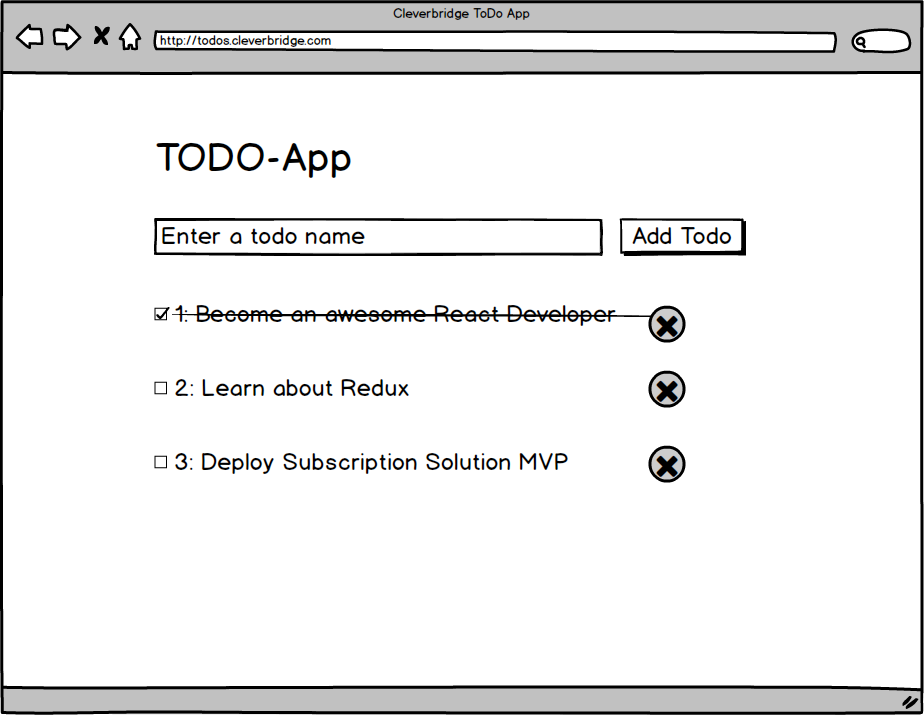
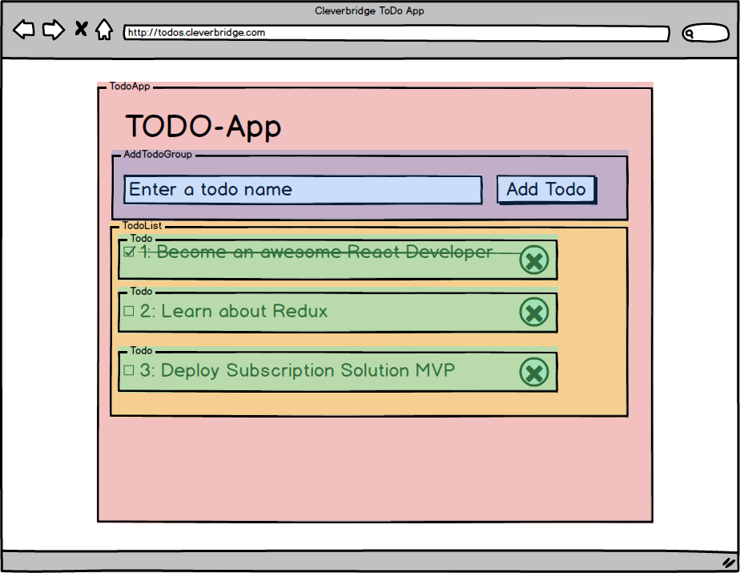
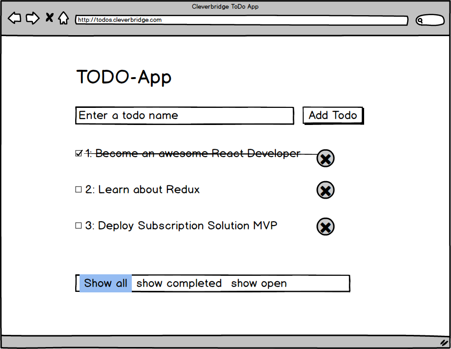
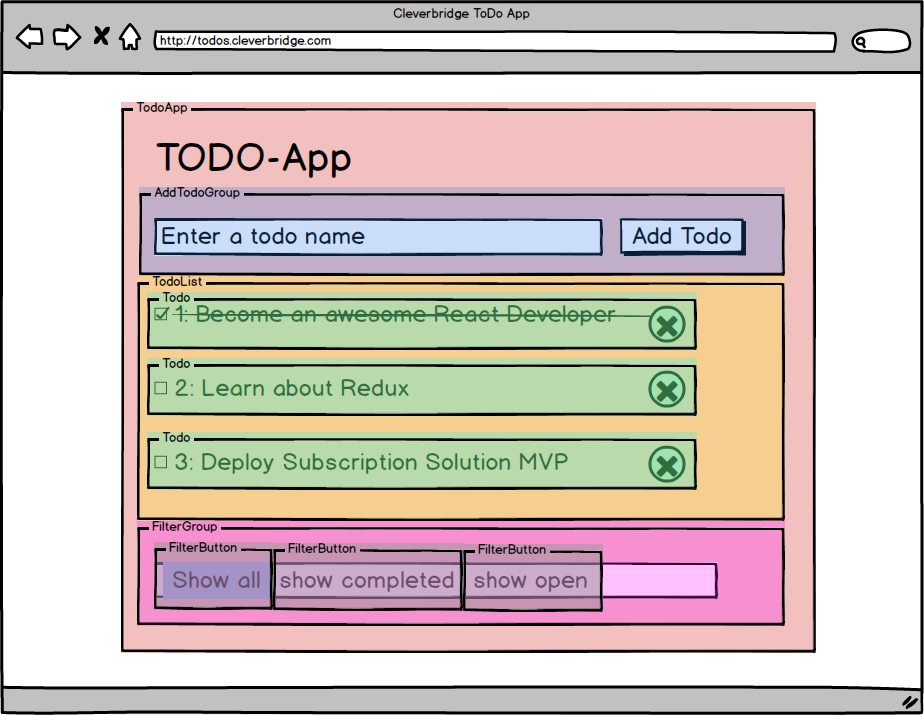
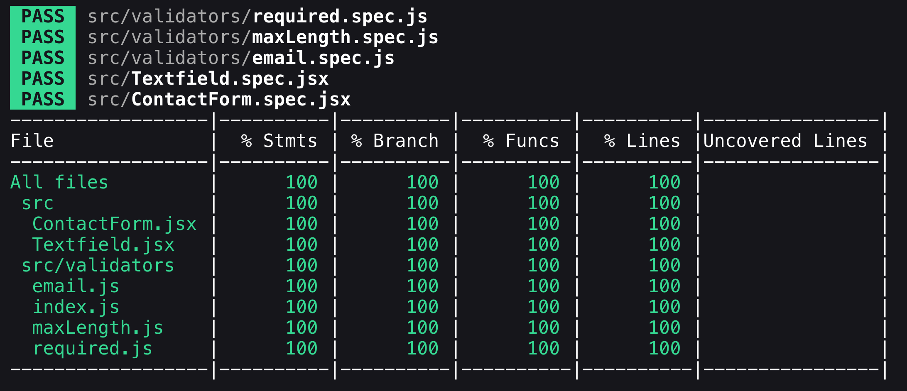

# Lessons

## Lesson 1

### Goal: Create declerative components with differing behavior based on props.

- Implement a `Likes` component
  - with a `likes` prop
  - shows a `BlueLike` component when `likes > 0`
  - shows a `GreyLike` component when `likes <= 0`
- For `BlueLike` / `GreyLike`:
  - renders a button with a specific background-color
- Add the Likes component to the `FirstComponent` twice
  - once with `likes > 0`
  - once without `likes`

## Lesson 2

### Goal: Seperate stateful and presentational components.

- Remove the `likes` prop from `Likes` component
- Add a likes state which is initially 0 (Hint: You need a stateful component now)
- Add a click-handler which increases the state
- Refactor `BlueLike` and `GreyLike` into a single component called `LikeButton`
- Pass the click-handler to `LikeButton`
- Make sure the `Button` components pass the click handler to the html element
- Display the amount of likes inside the Button text

## Lesson 3

### Goal: Add PropType validation and default prop values.

- Add propType validation for like button
  - Modify one of the props and see the error in the browser
- Add a default clickHandler to the `LikeButton`
  - e.g. use a console.log or alert in the new default
  - Temporarily remove the clickHandler passed from Likes and see the result

## Lesson 4

### Goal: Write unit tests for React components.

- Add Unit tests for the `LikeButton` component
- Make sure the file is covered 100% (branch, statemens, lines)
- Use these test suggestions:
  - **it** displays the number of likes in the text output
  - **it** passes a click Handler to the component
  - **it** has a grey background color when likes prop === 0
  - **it** has a blue background color when likes > 0

## Lesson 5

### Goal: Build a working todo app.

To get started please checkout `origin/before-lesson-05`.

 

- Start building the TODO app according to the mockup.
- It should have the following features:
  - Subtask 1: There is a list of all todos (completed and open)
  - Subtask 2: Clicking on a todo will mark it as clicked (both in the state and visually)
    - Clicking it again, will mark it as open again.
  - Subtask 3: You can add a name for a new todo and add it to the list
    - After clicking the add button, the input field should be empty again
  - Subtask 4: Clicking the delete button will delete the todo
- Make sure all components which accept props, have their props validated.
- Try adding some basic styling to make it look less 1995-like.
- Tip: Centralize the state in the main component and keep all other components stateless.
  *Note: We'll learn about better state management later. For it's only important to respect the one-way data-flow.*
- Tip: Don't worry about assigning ids right now. Since we don't support sorting or filtering yet, you can simple use the array index to modify/delete a todo.
- **Remebmer**: State is immutable. Don't accidentaly mutate the state. this.state.todos.push() is an anti-pattern! Props.todos.push is even worse! Think about data-flow in react apps.

## Lesson 6

### Goal: Improve Data organization and add filtering abilities in our todo app.

 

- Restructure the todos array into an object which uses the id for direct property access
  - make use of ES6/ES7 methods (object desctructuring, spread operator, ...) in your `toggleTodo`, `addTodo` and `deleteTodo` methods.
- Add a `FilterGroup` with `FilterButton` components which can set the `filter` state
- Depending on the filter state (declerative!), pass a filtered list to the `TodoList` component.

*Note: To see how the form would look with a controlled component, checkout `origin/lesson-06-with-controlled-component`*

## Lesson 07

- Move all state to Redux
- All components should be stateless now

## Lesson 08

### Goal: Our very first Redux Form component

- Add a basic form with the following fields:
  - Name (textfield)
  - Email (textfield)
  - Subject (textfield)
  - Message (textarea)
  - Newsletter (checkbox)
- on submit log the values to the console
- add some styling
- don't forget the tests
  - they will be simple, but you should still practice them.

## Lesson 09

### Goal: A dynamic, constantly validated form

- Create a couple of validators
  - all validators return undefined if no error occurred
  - they return a string (such as "This field is required") if an error occurs
-Validate theses fields:
  - Validate all fields for required (i.e. not empty)
  - Validate email for a valid email (use a simple Regex or a package if you like)
- Change the component passed to `Field` to an own component which can highlight errors
  - Make sure errors are only shown if the field is touched
  - Highlight the error string output in red
  - Give the field a red border on error
- Make sure everything is tested

This is what your test coverage could look like after this lesson:

## Lesson 10

### Goal: Client-Side-Routing

- Implement React Router
- Move the contact form to a '/contact' route
- Show a home site on '/'
- Show an about site on '/about'
- Highlight the currently active item in the navigation

## Lesson 11

### Production-Readyness and Docker Deployment

- Add WebpackHTMLPlugin to generate an index.html dynamically
- Add an npm command to trigger a production build
- Install and setup express (or any other webserver) so serve the dist build
- Add a Dockerfile to build and serve your dist build
